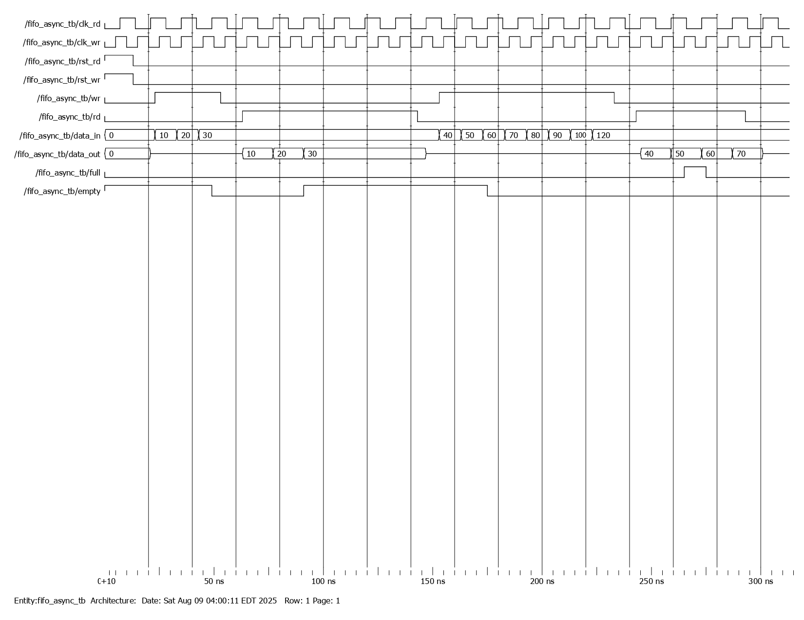
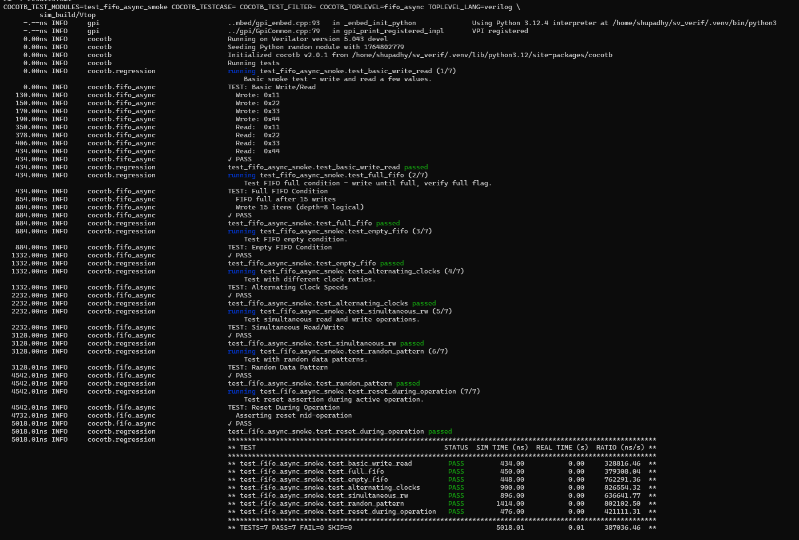
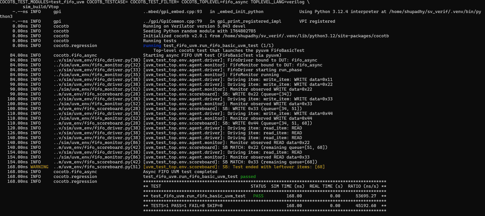

# Asynchronous FIFO

## Overview
This repository implements an asynchronous FIFO in Verilog. The design supports independent read and write clock domains and uses Gray code pointer synchronization. It includes functional verification with a Verilog testbench and a complete verification environment using cocotb, Verilator, and pyuvm.

## Design Concept

### Independent Clock Domains
The FIFO supports:
- `clk_wr` write domain clock
- `clk_rd` read domain clock
- `rst_wr` write domain reset
- `rst_rd` read domain reset

The write and read domains operate independently. Pointer values cannot be directly compared across domains and must be synchronized.

### Gray Code Pointer Architecture
Binary pointers are converted to Gray code:
```verilog
assign wr_ptr_gray = wr_ptr_bin ^ (wr_ptr_bin >> 1);
assign rd_ptr_gray = rd_ptr_bin ^ (rd_ptr_bin >> 1);
```
This ensures only one bit toggles per increment, reducing the possibility of metastability when pointer values are passed to the opposite domain.

### Dual Synchronizers for CDC
Each pointer crossing is passed through a two stage synchronizer:
```verilog
always @(posedge clk_rd or posedge rst_rd) begin
    if (rst_rd) begin
        wr_ptr_s1 <= 0;
        wr_ptr_s2 <= 0;
    end else begin
        wr_ptr_s1 <= wr_ptr_gray;
        wr_ptr_s2 <= wr_ptr_s1;
    end
end
```
The write pointer is synchronized into the read domain and vice versa. This isolates metastability and provides stable values for flag computation.

### Pointer Width and Wrap Detection
Pointers include an additional MSB to differentiate full and empty conditions after wrap around:
```verilog
reg [ptr_depth : 0] wr_ptr_bin, rd_ptr_bin;
```

### Full and Empty Logic
Full detection (write domain):
```verilog
assign full = (wr_ptr_gray ==
               {~rd_ptr_s2[ptr_depth], rd_ptr_s2[ptr_depth-1:0]});
```

Empty detection (read domain):
```verilog
assign empty = (rd_ptr_gray == wr_ptr_s2);
```

## Block Diagram


## Schematic
The post synthesis schematic confirms correct implementation of Gray code pointer logic, dual synchronizers, and dual clock operation.

[Schematic PDF](images/Schematic.pdf)

## Clock Domain Crossing Verification
The FIFO is verified with independent clocks:

- Write clock: 10 ns
- Read clock: 14 ns
- No defined phase relationship

The waveform shows correct pointer synchronization, delay in flag updates, and safe CDC behavior.

### Key Verification Observations
- Empty deasserts after write pointer propagates to read domain
- Full asserts only when Gray pointers satisfy the wrap condition
- Output data updates only on read clock edges
- No glitches in synchronized pointer signals
- No metastability warnings across simulations

## Waveform Output



## Functional Behavior Summary

| Event | Observed Behavior |
|-------|-------------------|
| Reset | Both domains reset independently |
| Initial Read | Output remains zero until first valid word is produced |
| Write Operations | Pointers update in write domain and propagate after synchronizer delay |
| Read Operations | Data output matches write order with one cycle latency |
| Full Condition | Correct assertion based on Gray code comparison |
| Empty Condition | Correct assertion after all entries are read |

## Verification

### Verilog Functional Testbench
A dual clock Verilog testbench validates basic FIFO behavior:

- Write burst
- Read burst
- Full and empty flag transitions
- Pointer wrap around

### cocotb Smoke Tests
A set of Python based tests verify:

- Basic write and read
- Full condition behavior
- Empty condition behavior
- Alternating clock ratios
- Simultaneous read and write
- Random data patterns
- Reset during active traffic

### UVM Verification with pyuvm
The UVM environment includes:

- Sequence items representing reads and writes
- Sequencer issuing ordered or randomized sequences
- Driver that applies operations to DUT
- Monitor that samples transactions
- Scoreboard with a Python reference model
- Environment and test layer controlling phases

All UVM tests pass successfully.

## Repository Structure
```
Asynchronous-FIFO/
├── images/               
├── rtl/                   
│   └── fifo_async.v
├── tb/                    
│   └── fifo_async_tb.v
├── sim/                   
│   ├── Makefile
│   ├── results.xml        # Test results and reports 
│   ├── test_fifo_async_smoke.py
│   ├── test_fifo_uvm.py
│   ├── uvm_env/           
│   │   ├── fifo_item.py
│   │   ├── fifo_driver.py
│   │   ├── fifo_monitor.py
│   │   ├── fifo_sequences.py
│   │   ├── fifo_scoreboard.py
│   │   ├── fifo_agent.py
│   │   ├── fifo_env.py
│   │   └── fifo_tests.py
│   └── sim_build/         # Verilator output and other auto-generated files 
│       └── __pycache__/   # Python cache 
├── run_sim.sh             # Script to run simulations
├── License.txt          
└── README.md              

```

## Simulation and Execution

### RTL Simulation
```bash
./run_sim.sh rtl
```

### Run cocotb Smoke Tests
```bash
./run_sim.sh smoke
```

### Run UVM Verification
```bash
./run_sim.sh uvm
```
## Verification Results

### Cocotb Smoke Test Summary
The smoke test suite validates basic FIFO functionality including write operations, read operations, flag behavior, clock-ratio variation, random patterns, and reset conditions.



### UVM Verification Summary
The UVM environment (driver, monitor, sequencer, scoreboard, and environment hierarchy) validates FIFO behavior at a higher abstraction level.  
The scoreboard confirms ordered write/read sequences across independent clock domains, ensuring CDC correctness.



## Tools
- Icarus Verilog for RTL testbench simulation
- Verilator for cocotb and UVM based simulation
- cocotb for testbench automation
- pyuvm for UVM style verification
- GTKWave for waveform analysis
- Vivado for synthesis and schematic generation


## License
See the [License.txt](License.txt) file for license information.